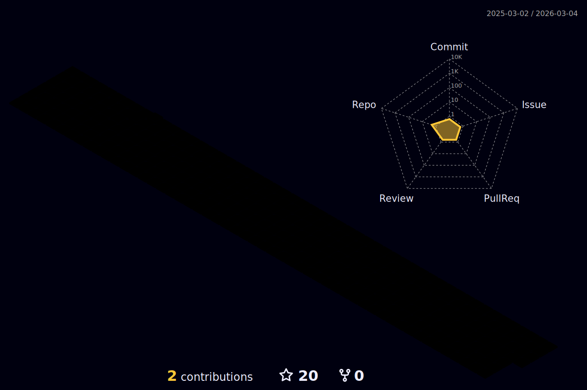

<!--
 * @Description: GitHub 配置文件自述文件
 * @FilePath: \README.md
 * @Author: Iceford rongquanhuang01@gmail.com
 * @Date: 2023-04-14 10:38:23
 * @LastEditors: Iceford rongquanhuang01@gmail.com
 * @LastEditTime: 2024-05-23 20:17:51
 * Copyright (c) 2023 by Iceford , All Rights Reserved.
-->

  

      
  

  

   
  

  

    <picture>
      <source media="(prefers-color-scheme: dark)" srcset="https://raw.githubusercontent.com/Iceford/Iceford/output/github-contribution-grid-snake-dark.svg">
      <source media="(prefers-color-scheme: light)" srcset="https://raw.githubusercontent.com/Iceford/Iceford/output/github-contribution-grid-snake.svg">
      
    </picture>
  

# 🙋 Hello

<table>
<tr><td>

## 🤺 About Me

&emsp;&emsp;Hi everyone, I'm Aloof .

&emsp;&emsp;Currently studying at Shenzhen University of Technology, majoring in computer science and technology.

&emsp;&emsp;Since I chose this major after the college entrance exam, let's go ahead in this industry !

&emsp;&emsp;After trying many directions, I still wanted to become a full stack developer.

&emsp;&emsp;My motto is that the best time to plant a tree was 10 years ago, the next best time is now.

</td></tr>

<tr>
<td>

## 🏢 Life Experience

- [Heyuan Longchuan First Experimental School](https://baike.baidu.com/item/%E6%B2%B3%E6%BA%90%E5%B8%82%E9%BE%99%E5%B7%9D%E7%AC%AC%E4%B8%80%E5%AE%9E%E9%AA%8C%E5%AD%A6%E6%A0%A1/59936961)  
  📌 2014/09 ~ 2017/07

- [Longchuan County No. 1 Middle School](https://baike.baidu.com/item/%E9%BE%99%E5%B7%9D%E5%8E%BF%E7%AC%AC%E4%B8%80%E4%B8%AD%E5%AD%A6/5388056)  
  📌 2017/09 ~ 2020/07

- [Shenzhen University of Technology](https://www.sztu.edu.cn/) 
  📌 2020/09 ~ 2024/06

  - College: [Big Data and Internet](https://bdi.sztu.edu.cn/)
  - Major: Computer Science and Technology
     

<!-- - [Shenzhen Urban Public Safety Technology Research Institute](https://www.szsti.org/#/) 
  📌 2023/02 ~ 2023/07
  - Job: Intern at R&D Center (Academician Office) -->

</td>
</tr>

<table>

## 👏 My Skills Chart

  

💪 Currently learning

 

🧠 Plan deep learning

 

🧰 Commonly used tools

 

<!-- GitHub 奖杯🏆 -->

     

    

  

   

  <!-- gif -->
  
  
  
  
  
  
   

  <!-- svg -->
  
  
  
  
   
  
  
  
  
  
  

  

